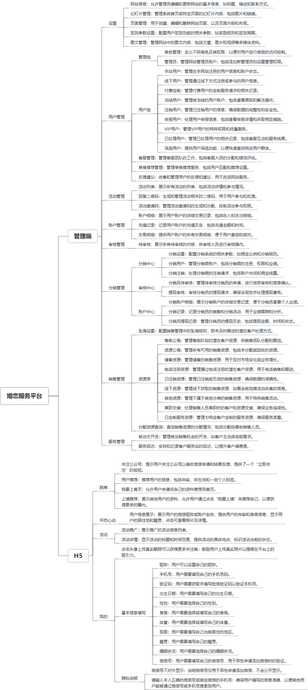

 

    
 

公司拥有上百套具有自主知识产权的软件系统，详情请查看码云首页或公司官网

 
<h1>婚恋服务公众号</h1>

<a href="https://www.haishi.net.cn/">公司官网</a> ｜ <a href="https://www.haishi.net.cn/">在线体验</a>

 

## 系统介绍

婚恋服务平台致力于为用户提供全面的婚恋交友服务，包含账户管理、充值记录、分销设置等多项功能，满足不同用户的需求。平台为单身用户提供个性化推荐和付费定制服务，并且通过严格的身份、职位和学历审核确保用户的真实性。平台还设有分销系统，用户可以通过一级和二级分销赚取佣金，同时平台支持提现审核及分销员提现记录管理。用户反馈、举报管理、VIP用户管理和牵线服务等功能，也进一步提升了用户体验。所有待审核的用户和交易记录都可以通过系统方便管理，确保平台的安全性与服务的高效性。此外，平台还通过设置公海资源和储备资源，增强了资源的灵活配置，满足各类婚恋需求。
婚恋服务平台致力于为用户提供全面的婚恋交友服务，包含账户管理、充值记录、分销设置等多项功能，满足不同用户的需求。平台为单身用户提供个性化推荐和付费定制服务，并且通过严格的身份、职位和学历审核确保用户的真实性。平台还设有分销系统，用户可以通过一级和二级分销赚取佣金，同时平台支持提现审核及分销员提现记录管理。用户反馈、举报管理、VIP用户管理和牵线服务等功能，也进一步提升了用户体验。所有待审核的用户和交易记录都可以通过系统方便管理，确保平台的安全性与服务的高效性。此外，平台还通过设置公海资源和储备资源，增强了资源的灵活配置，满足各类婚恋需求。
本项目为婚恋服务平台，旨在为用户提供线上和线下相结合的婚恋服务。该平台包含管理端和H5端两个主要终端。
- 管理端：平台管理员使用，具备用户管理、活动管理、财务管理、审核管理、分销管理、销售管理、服务管理等功能，可以对平台进行全面的运营管理。
- H5端：用户使用，提供首页推广、上墙推荐、怦然心动、活动参与、个人中心等功能，方便用户进行互动和寻找伴侣。
                

## 系统功能介绍

### 系统包含终端说明

管理端（WEB）、用户端（H5）

| 序号 | 模块 | 模块说明 |
| --- | --- | --- |
| 1 | FWY-HLFW-MP-SERVER | 服务端 |

### 系统功能结构

### 系统功能说明

管理端功能：
- 用户管理：管理用户组、角色权限、用户信息，包括本站用户、线下用户、付费定制用户、冻结用户、注销用户、举报用户、VIP用户等，并提供客服管理和单身推荐管理功能。
- 活动管理：创建、管理和发布线上线下活动，包括活动列表管理、回复二维码管理、活动邀请码管理等。
- 财务管理：管理平台的财务状况，包括账户明细、充值记录、交易明细等。
- 审核管理：审核用户提交的信息、分销申请、提现申请等内容。
- 分销管理：管理分销中心，包括分销设置、分销用户管理、分销注销管理、审核中心、账户中心等。
- 销售管理：管理销售资源，包括坠海设置、资源库管理（售前公海、资源公海、储备资源、电话注册资源、已注销资源、线下资源、其他资源、已定制服务资源）、分配资源查询等。
- 服务管理：管理用户服务，包括被动方开发、服务回访等。
H5端功能：
- 首页：展示平台的推荐内容和活动信息。
- 脱单：提供首页推广和上墙推荐功能，帮助用户快速找到合适的对象。
- 怦然心动：提供用户互动和匹配的功能。
- 活动：展示平台的活动信息，方便用户参与。
- 个人中心：用户管理个人信息、查看参与的活动、查看匹配结果等。

## 系统主要界面

## 系统技术说明

### 代码模块说明

| 序号 | 目录 | 目录说明 |
| --- | --- | --- |
| 1 | FWY-HLFW-MP-SERVER/app | -- |
| 2 | FWY-HLFW-MP-SERVER/public | -- |
| 3 | FWY-HLFW-MP-SERVER/data | -- |
| 4 | FWY-HLFW-MP-SERVER/vendor | -- |

### 系统技术选型

#### 开发语言/框架

PHP
前端框架：VUE2
框架：ThinkPHP
系统结构：单体应用

#### 服务中间件

Nginx

#### 数据库

MySQL（5.7+）
Redis

#### 其他说明

无

## 系统演示/商用

请扫码添加客服微信获取演示地址和系统详细资料。

如果您想基于婚恋服务公众号进行商业化交付或定制开发服务，我们提供有偿的技术服务支持，合作模式不限，欢迎沟通！

公司官网地址： <a href="https://www.haishi.net.cn/">https://www.haishi.net.cn</a>

联系客服获取专业回答。

## 使用须知

1、 本项目商用必须获得版权所有者的授权。

2、 未经允许本项目代码不允许二次出售。

